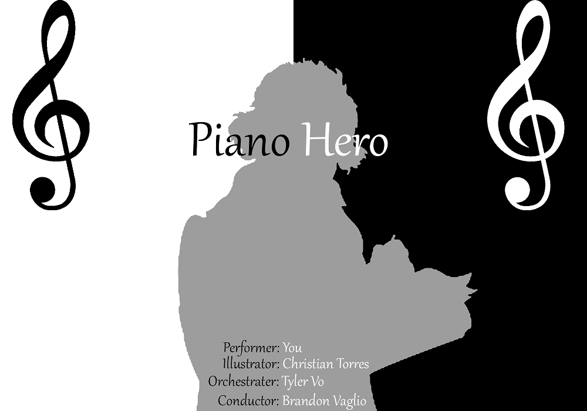
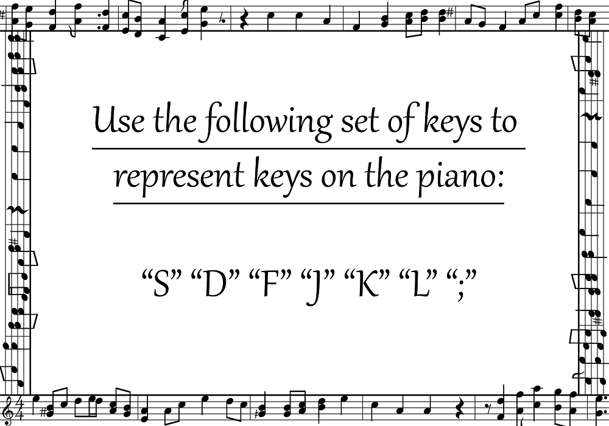
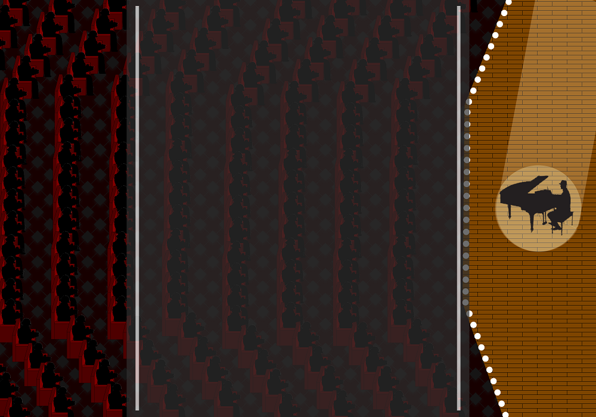
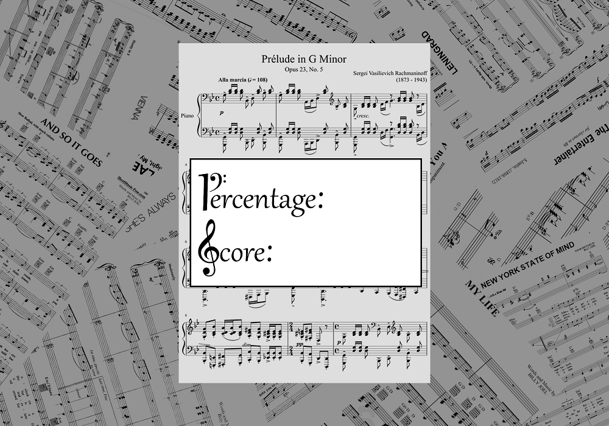
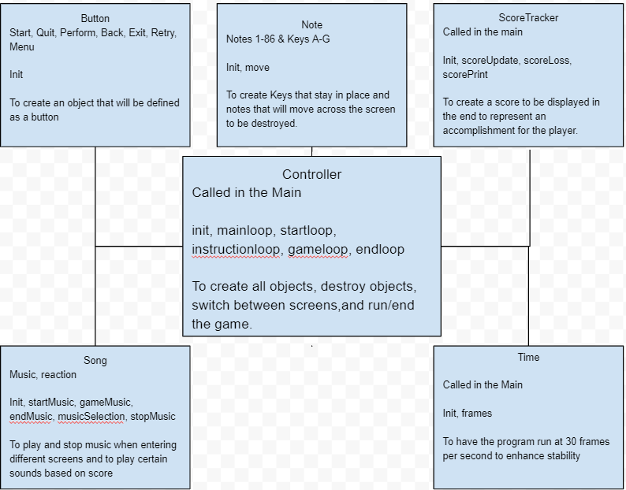

:warning: Everything between << >> needs to be replaced (remove << >> after replacing)

# Piano Hero
## CS 110 Final Project
### Fall, 2019
### [Assignment Description](https://drive.google.com/open?id=1HLIk-539N9KiAAG1224NWpFyEl4RsPVBwtBZ9KbjicE)

<< [https://github.com/<repo>](#) >>

<< [https://docs.google.com/presentation/d/147vqlt9MClgTxoIDI4UqthQY8iUPC_tEuzlkcJTcty4/edit?usp=sharing](#) >>

### Team: Penguins
#### Tyler Vo, Christian Torres Alonzo, Brandon Vaglio

***

## Project Description
A rythym game that uses the keyboard and plays classical music. The point of the game is to introduce people to classical music while still being fun.

***    

## User Interface Design
* Start Screen
    * 
    * This is the screen the user ssees upon starting the game. The start screen displays the name of the game "Piano Hero", and the "Play" and "Quit"  buttons.

* Instructions Screen
    * 
    * The user is given instruction on how to play the game on this screen. This screen has the "perform" button which starts the game, and the "back" button which goes back to the start screen.

* Game Screen
    * 
    * The game screen shows the gui the player will interact with, with button presses relating to each key shown at the bottom. Keys will fly in from the top to be "keyed" at the bottom. This screen has an "exit" button for leaving the game early.

* End Screen
    * 
    * The end screen will display when the player has ended the song or failed to complete the song. It will display their score and percent complete for the run. This screen has a "retry" button for playing again, "menu" for going back to the instruction screen, and "quit" for exiting the program.
***        

## Program Design
* Non-Standard libraries
    * pygame

		*https://www.pygame.org/docs/

		*Includes music playback funtionality and some graphics.

* Class Interface Design
        * 

    * This does not need to be overly detailed, but should show how your code fits into the Model/View/Controller paradigm.
* Classes
    * Note

		*Creates the note and their position. Includes move function which sets speed of Note
    * Song

		*All sound and music goes into this class. Includes startMusic function which plays music at the start screen, the gameMusic function which starts the music at the game screen, the endMusic function which plays the end screen sound effects, the musicSelect function which chooses which audience noise is played based off of user score at the end screen, and the stopMusic function which stops whatever music is playing.
    * Button

		*Sets the size and image of the button.
	* Time
		
		*Sets the frame rate of the game to 30 frames per second.
	* ScoreTracker

		*Keeps track of the player score. The scoreUpdate function adds one point to the player score for each successfully destroyed note. The scoreLoss function deducts .5 points from the player score for whenever the player presses the key before the note overlaps with the key. The scorePrint function prits the player score at the end screen.
	* Controller

		*Establishes the relationship between all of the different classes. Collisions, key events and key bindings, images, and the redrawing of the screen occurs here.

***

## Tasks and Responsibilities
* You must outline the team member roles and who was responsible for each class/method, both individual and collaborative.

### Software Lead - Tyler Vo

<< Worked as integration specialist by helping organizing the code for MVC format, which allowed all portions of the code to run from a single file. Organized the code to be more readable. Worked with the Front-End to help form the layout of the game and debugged any issues that caused the game to not function as intended. Worked with the back end to develop sound-related functionality and debugged any issues that caused the game to not function as intended. Mapped all of the notes into the game. Optimized code as much as possible so the program can run as smoothly as possible.  >>

### Front End Specialist - Christian Torres Alonzo

<< Front-End lead conducted significant research on using pygame to create visual aspects such as buttons and on-screen text. He used this information to create the UI for the "Start Screen", "Instruction Screen", and the "End Screen". Researched in changing the state of the game based on player action. He also designed and implemented game graphics. Designed and implement the Controller class, which encapsulates the logic of the game. Collaborated with the Software Lead in the placement and creation of the button. Collaborated with the Back-End lead to implement the score in the end screen. >>

### Back End Specialist - Brandon Vaglio

<< The back end specialist wrote all the major functions of the game. Implemented the Note functionality which allowed the Note to move. He also collaborated with the Software lead to implement the Sound functionality, which allowed certain music and sound effects to play depending on the game state and user score. Created the scoreTracker class which tracks the player's score and prints it onto the "End Screen." Worked with the the Front-End lead to implement the score in the end screen. >>

## Testing
* << Testing Procedure >>
    * << We did most of our testing through trial and error. If a piece of code did not run, we went back and tweaked that part of the code. Specific things we tested included the correct placement and movement of the notes, the placement of the keys, whether the Score Tracker was accurately tallying collisions, whether audio files were being called upon at the correct times, and whether lag was present. The most difficult part to fix was lag and lag spikes, which threw the notes off the rhythm. We used the method convert_alpha onto images to load images faster. We also added a flag that was called DOUBLEBUF to the pygame.screen.display, which buffered the images/drawings before displaying onto the screen. We added a class called Time which essentially locked the frame of the game to 30 frames per second. We also took all the sprites and added them to a sprite group and drew them all onto the screen at once. The combination of all of times reduced the amount the game lagged significantly and allowed all of those to line up correctly
 >>

* ATP

| Step                  | Procedure     | Expected Results  | Actual Results |
| ----------------------|:-------------:| -----------------:| -------------- |
|  1  | Run main.py  | Program opens to the start screen and is functional. Music is playing on a loop.  |          |
|  2  | Click "Play" | Opens to the instruction screen and is functional. Music from the start screen continues to play. |                 |
|  3  | Click "Back"  | Opens to the start screen and is functional. Music from the start screen continues to play. |                 |
|  4  | Click "Play"  | Opens to the instruction screen and is functional. Music from the start screen continues to play.|                 |
|  5  | Click "Perform"  | Opens to the game screen and is functional. Music from the start screen stops playing, and the game music begins. Notes approach the piano keys from above. |                 |
|  6  | Press the respective keys on the keyboard when the notes on the screen overlaps with the piano key.  | Note is destroyed. Game music continues to play. |                 |
|  7  | Press the keys before the notes overlaps with the piano key | Notes remain on the screen. Game music continues to play. |                 |
|  8  | Click "Exit"  | Opens to the end screen and is functional. The score is displayed. Game music ends. No music is playing. |                 |
|  9  | Click "Menu"  | Opens to the instruction screen and is functional. Start screen music plays |                 |
|  10 | Click "Perform"  | Opens to the game screen and is functional. Music from the start screen stops playing, and the game music begins. Notes approach the piano keys from above. |                 |
|  11 | Play the game all the way through  | Automatically brings user to endscreen. The score is displayed. Game music ends. |                 |
|  12 | Click "Retry"  | Opens to game screen and is functional. Game music begins. Notes approach the piano keys. |                 |
|  13 | Click "Exit"  | Opens to the end screen and is functional. The score is displayed. |                 |
|  14 | Click "Quit"  | Program closes |                 |
